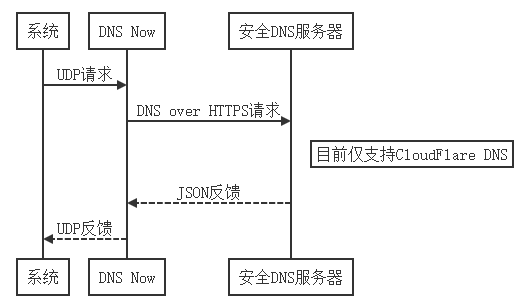
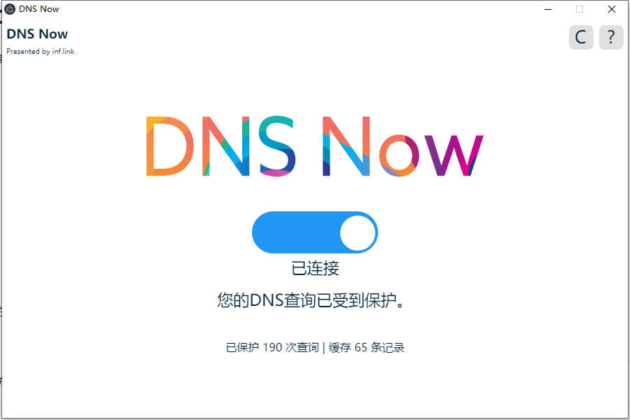

<p align="center">
 

# DNS Now
DNS Now是一款能够在本地搭建安全DNS服务器的软件，其工作的大致流程如下：

<p align="center">
 

同时DNS Now会在本地维护一个LRU缓存，减少网络负担，加速DNS请求速度。DNS Now目前还处于开发阶段，不建议用于生产环境。

## 使用方法

对于Windows系统可以直接下载Release文件，运行exe即可。对于其他系统需要保证Node.js开发环境，运行以下命令：

```
$ npm i
$ npm start
```

此时DNS Now会监听本地的53端口，这时候我们将网络的DNS地址修改为本地（127.0.0.1）即可。

### 按钮说明

- C：清除缓存
- ？：查看帮助页面

## 截图

<p align="center">
 

## 感谢

- CloudFlare
- [dns2](https://github.com/song940/node-dns)
- [Lru cache](https://github.com/isaacs/node-lru-cache)

